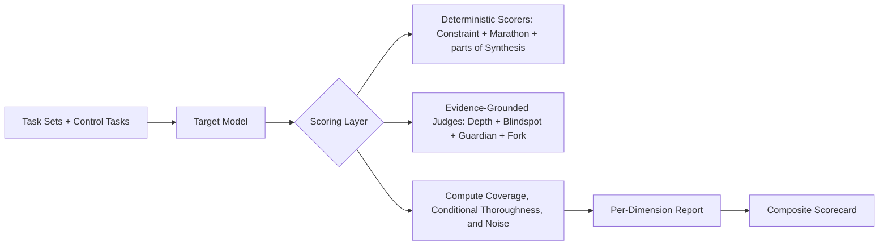

# Thoroughness Evaluation Benchmark (TEB)

A benchmark framework for measuring how exhaustively, proactively, and reliably models complete tasks once they are capable of the underlying work.

---

## Core Thesis

> Most benchmarks measure whether a model can reach a correct answer.
> TEB measures whether a model finishes the whole job without skipping constraints, edge cases, risks, or evidence.

This matters because in agentic and production settings, a model that gets 95% of a refactor right but silently drops the last 5% is often less useful than one that is slightly weaker overall but reliably surfaces gaps, flags risks, and completes every required step.

TEB is therefore designed to estimate **thoroughness conditional on capability**. It does not pretend capability is irrelevant. Instead, it tries to distinguish:

- "The model could not do this at all."
- "The model could do it, but failed to do it completely."

---

## Design Principles

### 1. Capability-Conditioned, Not Capability-Blind

Whenever possible, each benchmark task is paired with smaller control tasks that test whether the model can handle the same atomic item in isolation. Missing an item only counts as a thoroughness failure if the model demonstrates that it is capable of handling that item on its own.

### 2. Correctness Is a Gate

No credit is awarded for exhaustive but wrong output. A constraint, flaw, warning, root cause, or transformation only counts if it is substantively correct.

### 3. Useful Coverage Beats Verbosity

The benchmark rewards complete, non-redundant answers. It penalizes unsupported warnings, hallucinated findings, unnecessary clarification, and padding that increases length without adding information.

### 4. Evidence Beats Plausibility

For review and synthesis tasks, the model should point to supporting evidence such as line numbers, excerpts, spans, or artifact locations. This reduces judge noise and discourages confident guessing.

### 5. Evaluation Must Match Deployment Mode

Thoroughness looks different in a single answer, a long-context analysis task, and a tool-using agent. TEB therefore defines separate tracks instead of forcing one score to cover all interaction styles.

---

## Benchmark Tracks

### 1. Single-Turn Assistant

For direct answers with no tools and no follow-up turns.

Examples:

- instruction-following with multiple embedded constraints
- open-ended explanations
- ambiguity handling in chat-style requests

### 2. Long-Context Analyst

For tasks where the model must read and synthesize large provided contexts.

Examples:

- incident report aggregation
- contract or policy review
- multi-document research summaries

### 3. Tool-Using Agent

For tasks where the model can inspect files, run commands, or iterate across turns.

Examples:

- repo-wide refactors
- bug triage and verification
- migration planning with validation

For this track, TEB scores the final answer and outcome, while also reporting process diagnostics such as search breadth, verification actions, and whether the agent explicitly checked its own work.

---

## Global Scoring Model

### Atomic Items

Each task is decomposed into atomic items. Depending on the dimension, an atomic item may be:

- one embedded constraint
- one distinct depth facet
- one planted flaw
- one proactive warning
- one ambiguity axis or interpretation
- one transformation unit
- one non-contiguous fact to retrieve and synthesize

Each atomic item has:

- `value_i`: importance weight
- `capable_i`: whether the model can handle the item in isolation or in a matched control task
- `complete_i`: whether the item is handled in the full task
- `correct_i`: whether the handling is substantively correct

### Two Core Metrics

For dimensions with atomic control tasks, report both metrics below.

```text
Absolute Coverage = sum(value_i * complete_i * correct_i) / sum(value_i)

Conditional Thoroughness =
  sum(value_i * complete_i * correct_i) /
  sum(value_i * capable_i)
```

If a model succeeds on an item in the full bundled task, that item is treated as `capable_i = 1` for denominator purposes even if the matched control task was missed. This prevents noisy control tasks from producing a score above 1.0.

Interpretation:

- **Absolute Coverage** answers: "How much of the full job got done?"
- **Conditional Thoroughness** answers: "Of the things this model appears capable of doing, how many did it remember to do in the full task?"

If the denominator for Conditional Thoroughness is 0, mark the metric as `N/A` for that item set rather than forcing a numeric score.

### Utility and Noise Penalties

Thoroughness is not the same as saying more things. TEB tracks the following noise classes:

- unsupported or hallucinated findings
- irrelevant warnings
- unnecessary clarifying questions
- redundant restatement presented as new information

Each dimension defines its own penalty schedule, but the benchmark always reports a separate **Noise Index** so evaluators can tell the difference between useful completeness and spammy overproduction.

```text
Noise Index = normalized weighted rate of hallucinated findings,
              irrelevant additions, unnecessary clarification,
              and redundant restatement
```

Lower is better.

### Information Density

TEB reports:

```text
Information Density = supported unique claims / total output tokens
```

Information Density is primarily diagnostic, but low-density responses can lose credit on depth-oriented and synthesis-oriented tasks when the extra length is mostly repetition.

### Evidence Requirement

For `Blindspot` and `Synthesis`, and optionally for `Guardian`, items only count if the model provides enough evidence for a grader to verify the claim.

Accepted evidence includes:

- file and line references
- quoted spans from the provided context
- exact config keys, functions, clauses, or sections

---

## The 7 Dimensions

### 1. Constraint Recall ("The Checklist")

**Question:** Does the model satisfy every meaningful part of a multi-faceted prompt?

**Method:** Prompts contain a primary request plus 4-12 embedded constraints. Constraints vary in importance and are tagged as one of:

- `critical`: omission changes correctness or safety
- `major`: omission materially lowers usefulness
- `minor`: omission affects format or polish

Some constraints are buried mid-paragraph or phrased as asides to test attentive reading. Each constraint also appears in at least one standalone control prompt.

**Example:**

> _Explain how TCP/IP works. Structure your answer as a dialogue between two engineers. Cover the 3-way handshake, congestion control, and Nagle's algorithm. Use one analogy involving postal mail. End with a comparison to UDP._

**Scoring:**

- Per-constraint credit requires the constraint to be both addressed and correct.
- Report `Absolute Coverage` and `Conditional Thoroughness` with severity weights.
- Missing a `critical` constraint hurts more than missing a `minor` format requirement.

---

### 2. Unprompted Depth ("The Iceberg")

**Question:** When given an open-ended prompt with no explicit instruction to be thorough, how much correct, non-obvious depth does the model naturally provide?

**Method:** Each prompt has a rubric of 5-8 non-overlapping depth facets rather than a single "highest layer reached" ladder. Facets span:

- core mechanism
- common misconception correction
- second-order implication
- expert-level nuance
- optional broader context when genuinely relevant

Some high-value facets also appear as matched control prompts to estimate whether the model knows them in isolation.

**Example:**

> _Why do mirrors reverse left and right but not up and down?_

Possible rubric facets:

- explains reflection geometry
- corrects the misconception that the mirror swaps left and right
- frames the issue as front-back reversal
- explains observer mental rotation or coordinate remapping
- mentions parity or chirality as advanced context

**Scoring:**

- Credit is awarded for each distinct, correct facet covered.
- Repetition does not increase score.
- Responses with low Information Density lose credit when apparent depth is mostly rephrasing.
- Report facet coverage, correctness, and Information Density together.

---

### 3. Edge-Case Exhaustiveness ("The Blindspot")

**Question:** When reviewing an artifact, how many real flaws does the model surface, and how cleanly does it separate true issues from hallucinations?

**Method:** Provide artifacts with 8-15 planted flaws at multiple severity tiers:

- `tier_1`: obvious issues such as off-by-one errors or missing null checks
- `tier_2`: subtle issues such as race conditions or unsafe coercions
- `tier_3`: adversarial issues that trigger only under rare combinations or unusual environments

Each flaw is associated with a location, mechanism, and expected impact. Some flaws also appear in isolated micro-reviews to estimate capability.

**Required answer format:** Each identified flaw must include:

- location or evidence
- why it is a problem
- likely impact or failure mode

**Scoring:**

- `Weighted Recall = sum(severity_i * true_positive_i) / sum(severity_i)`
- `Precision = true_positives / (true_positives + false_positives)`
- `Blindspot Score = F2(Precision, Weighted Recall)` to prioritize recall while still penalizing shotgunning
- A flaw only counts if it is correct and grounded in evidence.

---

### 4. Proactive Flagging ("The Guardian")

**Question:** Does the model surface risks, prerequisites, or important context that the user failed to mention but would reasonably want to know?

**Method:** Prompts are answerable as written, but a thorough assistant should raise additional flags. Gold flags are labeled as:

- `critical`: likely to cause security, data-loss, legal, or production-impact issues
- `important`: materially affects success, scope, or maintenance
- `optional`: useful but non-essential context

**Example:**

> _Write me a Python script that deletes all `.tmp` files in a directory._

A thorough response should not only write the script, but also consider items like:

- whether recursion is intended
- symlink behavior
- dry-run support
- accidental deletion outside the target boundary
- handling files in use or permission failures

**Scoring:**

- Use weighted recall over the gold flag set.
- Each flag only counts if it is accurate and paired with a short rationale or mitigation.
- Reasonable extra flags receive no bonus.
- Irrelevant, alarmist, or unsupported warnings count toward the Noise Index and reduce the dimension score.

---

### 5. Disambiguation ("The Fork")

**Question:** When a prompt is materially ambiguous, does the model handle the ambiguity safely—making its reasoning visible and protecting the user from silent misinterpretation?

**Method:** Prompts contain one or more **ambiguity axes** (distinct points permitting multiple valid interpretations). The model is graded on the visibility and safety of its ambiguity handling, not on which strategy it selected. 

Each ambiguity axis is an atomic item annotated with:
- whether it is **blocking** (proceeding risks a harmful or incorrect outcome) or **non-blocking** (any reasonable choice is useful)
- its `value_i` weight (defaults: 2.0 for blocking, 1.0 for non-blocking)
- objective, operationally verifiable conditions that would make a strategy "wasteful" for that specific axis
- a matched control prompt that isolates the axis to estimate `capable_i`

**Example:**

> _How do I handle exceptions in my app?_

Ambiguity axes include: Language (Python, Java, JS? — Non-blocking), Meaning of "handle" (try/catch vs. error states? — Non-blocking), and App type (CLI, Web? — Non-blocking).

**Scoring:**

Instead of a binary `complete_i`, each ambiguity axis receives an `execution_score_i`:
- **1.0 (Visible Resolution):** The model explicitly states an assumption, covers branches, or asks a highly targeted question. The user can immediately identify what interpretation was used.
- **0.5 (Visible but Wasteful):** The model safely resolves the ambiguity but uses a strategy that adds pure friction. Verifiable examples: asking a question whose answer is already present or trivially inferable from the prompt, asking about a non-blocking axis where a stated assumption was visibly better, or covering branches that yield identical advice.
- **0.0 (Silent Assumption):** The model arbitrarily proceeds down one path without signaling that interpretations exist. This is the primary failure mode.

The base dimension score uses:
`Absolute Coverage = sum(value_i * execution_score_i * correct_i) / sum(value_i)`

Because each axis has a matched control prompt, TEB also reports:
`Conditional Thoroughness = sum(value_i * execution_score_i * correct_i) / sum(value_i * capable_i)`

**Calibration & Reporting:**
- **Calibration Anchors:** 20% of prompts have polarized stakes (e.g., destructive database actions) where the correct strategy has near-universal expert agreement. These anchor inter-judge reliability.
- **Strategy Bias Profile:** A descriptive breakdown of how often the model asks, assumes, or branches is reported alongside the score to help with UX tuning (this does not affect the TEB Composite).
- **Noise Index Boundary:** Wasteful clarification on Fork prompts is penalized via the 0.5 tier. Unnecessary clarification on unambiguous (non-Fork) prompts is penalized by the global Noise Index stringently.

---

### 6. Generation Endurance ("The Marathon")

**Question:** On long-output or exhaustive transformation tasks, does the model complete the full job instead of shortcutting, truncating, or replacing work with placeholders?

**Method:** Tasks require complete, mostly mechanical output, such as:

- repo-wide renames
- schema transformations
- exhaustive config rewrites
- checklist completion across many items

To avoid confounding model thoroughness with provider output caps, TEB supports two task classes:

- `single_turn_fit`: the full correct output fits comfortably inside the standardized output budget
- `multi_turn_allowed`: the model may declare a chunking plan and complete the task over a fixed turn budget

**Example:**

> _Rename every key in this 200-line JSON file from snake_case to camelCase and output the full transformed file._

**Scoring:**

- `Unit Accuracy = correct transformed units / total units`
- `Completion Rate = completed units / total units`
- `Marathon Score = Unit Accuracy * Completion Rate`
- Silent truncation, `...`, `etc.`, or placeholder comments count as incomplete work.
- Honest chunking is allowed only in `multi_turn_allowed` tasks and receives full credit if the model completes the job within the turn budget.

---

### 7. Exhaustive Synthesis ("The Weaver")

**Question:** When information is scattered across a long context, does the model retrieve every relevant piece and synthesize them into a complete answer?

**Method:** Provide long contexts such as transcripts, incident reports, legal materials, or bug logs. Gold answers contain multiple non-contiguous facts, root causes, decisions, or caveats. Some facts also appear in isolated retrieval controls.

**Example:**

> _Based on these 15 incident reports over the last year, list every distinct root cause that contributed to a server outage._

**Required answer format:**

- a deduplicated answer list
- citations or quoted evidence for each claimed item

**Scoring:**

- `Fact Recall`: proportion of gold facts found
- `Citation Precision`: proportion of cited evidence that actually supports the claimed fact
- `Aggregation Quality`: whether duplicates are merged correctly and distinct causes are not collapsed together
- `Synthesis Score = 0.7 * Fact Recall + 0.2 * Citation Precision + 0.1 * Aggregation Quality`

This dimension measures exhaustive retrieval plus clean synthesis, not just plausible summarization.

---

## Agent Track Diagnostics

The Tool-Using Agent track reports the core 7 dimensions plus process diagnostics that help explain why a model was or was not thorough. 

These diagnostics operate entirely on verifiable tool-call traces (terminal logs) without requiring subjective annotation. They are reported separately from the main TEB Composite Score to preserve comparability across non-agent tracks, serving instead as a behavioral fingerprint of the agent.

### Process Diagnostics

#### 1. Inspection Breadth
**What it measures:** Whether the agent explored the relevant problem context before making changes.
**Metric:** `F1(Precision, Recall)` of distinct files read, searched, or listed *prior to the first write action*, compared against a prompt-annotated gold set of relevant files.

#### 2. Verification Actions
**What it measures:** Whether the agent validated its work by running environment checks.
**Metric (Ordinal 0-2):**
- **0:** No environment-validating command (e.g., tests, linters, compilers) executed.
- **1:** Verification executed, but it either failed without subsequent correction or occurred *before* the agent's final edit.
- **2:** Verification executed *after the final edit* and returned a success code (exit 0).

*(Boundary condition: If the task has no runnable verification available, this metric is marked `N/A` and excluded from the agent's composite.)*

#### 3. Self-Audit Quality
**What it measures:** Whether the agent reviewed and validated its own changes before declaring completion.
**Metric:** Combines two behaviors, each scored 0 or 1:
- **Change Review:** Did the agent explicitly inspect the diff of its edits (e.g., `git diff` post-edit)?
- **Completeness Verification:** Did the agent search for remaining instances of the target pattern or re-run the failing test case after its final edit?
*Composite score: {0.0, 0.5, 1.0} derived from the average of the two behaviors.*

#### 4. Premature Closure Rate
**What it measures:** How often the agent stops working in a state that is observably incomplete.
**Metric:** Rate of tasks where the agent submits a completion signal under any of the following conditions:
1. The last command returned a non-zero exit code.
2. The task supports verification, but the agent never executed one.
3. The edited files contain detectable syntax errors.

*(Boundary condition: The denominator only includes tasks where `verification_available = true` to avoid penalizing tasks where verification is structurally impossible.)*

#### Diagnostics Overlap Boundaries

**General Principle:** Diagnostics score process; core dimensions score outcomes. A single behavior is never penalized by both.

| Behavior | Scored By | Not Scored By |
|----------|-----------|---------------|
| Agent reads irrelevant files (wasteful exploration) | Inspection Breadth (precision penalty) | Noise Index (handles conversational noise, not tool-use noise) |
| Agent asks unnecessary clarifying questions | Fork / Noise Index (per existing boundary rules) | Agent diagnostics (only tracks tool actions, not conversational behavior) |
| Agent fails to verify and produces wrong output | Premature Closure (penalizes the incomplete process) | Correctness dimensions (Blindspot, Depth, etc. score the final outcome) |

---

## Composite Reporting

### Report a Vector First, Composite Second

TEB should always report the per-dimension vector before the headline composite score. Different models fail in different ways, and a single number can hide important trade-offs.

Recommended public scorecard:

- `TEB Composite`
- `Absolute Coverage Composite`
- 7 per-dimension scores
- `Noise Index`
- track-specific diagnostics where applicable

### Hypothetical Default Weights (Pre-Calibration)

Each dimension is defined on a 0-1 scale, so TEB uses an absolute weighted average rather than min-max normalization against a peer set. `Absolute Coverage Composite` is the same weighted average computed over the per-dimension Absolute Coverage values.

Prior to empirical calibration, TEB presents default weights natively as functional tiers rather than precise point estimates, avoiding the implication of hyperparameter tuning that has not yet occurred. Within-tier dimensions share allocation equally until calibration data dictates otherwise.

#### General-Purpose Profile
| Tier | Allocation | Dimensions |
|------|-----------|------------|
| **Primary** | ~20% | Edge-Case Exhaustiveness |
| **Secondary** | ~60% | Constraint Recall, Proactive Flagging, Generation Endurance, Exhaustive Synthesis |
| **Tertiary** | ~20% | Unprompted Depth, Disambiguation |

#### Domain-Specific Profiles

Different deployments prioritize different definitions of thoroughness:

- **Code Agent Profile:**
  - **Primary (~50%):** Blindspot, Marathon
  - **Secondary (~35%):** Guardian, Constraint, Depth
  - **Tertiary (~15%):** Synthesis, Fork
- **Research Assistant Profile:**
  - **Primary (~50%):** Synthesis, Depth
  - **Secondary (~35%):** Blindspot, Fork, Marathon
  - **Tertiary (~15%):** Guardian, Constraint
- **Content / Editing Profile:**
  - **Primary (~50%):** Constraint, Synthesis
  - **Secondary (~35%):** Depth, Fork, Guardian
  - **Tertiary (~15%):** Blindspot, Marathon

### Weight Graduation Protocol

TEB provides a strict calibration protocol to graduate these prior tiers into concrete point-estimate weights:

1. **Prerequisite:** Evaluate ≥ 5 models spanning multiple capability tiers using the tier-based default weights.
2. **Sensitivity Sweep:** Perturb the tier allocations (e.g., shifting ±10% from a Primary to a Tertiary dimension) and record the resulting model rank ordering.
3. **Rank Stability Index (RSI):** Compute the fraction of perturbations that preserve the original model rank ordering.
4. **Graduation:** 
   - If **RSI ≥ 0.85**, publish the tier-level weights; point-estimate tuning is unnecessary as the ranking is insensitive to minor shifts.
   - If **RSI < 0.85**, identify the rank-sensitive dimension pairs and lock their ratios to maximize adjacent-model separation, producing concrete point estimates.

#### Revalidation Triggers

Re-run the graduation protocol when:
- A new dimension is added to TEB.
- The model pool for a profile changes materially (e.g., a new capability class enters the evaluation).
- A deployment team manually overrides more than two dimension weights (signal that default priors no longer fit).

---

## Evaluation Pipeline



### Scoring Stack

1. **Deterministic scoring first:** Use parsers, exact-match logic, AST checks, schema checks, or citation matching whenever possible.
2. **Judges only where needed:** Use LLM judges for dimensions that genuinely require interpretation.
3. **Evidence-grounded judging:** Judges must cite response spans and, where relevant, source spans.
4. **Human adjudication on unstable items:** Low-agreement items are reviewed rather than silently dropped.

### Judge Calibration

- Use 3 independent judges on subjective dimensions.
- Blind judges to model identity and vendor.
- Report inter-judge agreement such as Fleiss' kappa.
- If `kappa < 0.6`, mark the item as low-confidence and send it for human adjudication.
- Periodically calibrate judges against a human-scored reference set.

### Contamination Resistance

To reduce benchmark gaming:

1. **Public dev set + private evaluation set:** Publish task formats and examples, but keep a held-out test set private.
2. **Procedural generation:** Generate variants of artifacts, constraints, flaw placement, and long-context documents from templates.
3. **Rotation:** Refresh the held-out set on a regular cadence.
4. **Canary items:** Include leakage detectors and flag suspiciously memorized behavior.
5. **Paraphrase robustness:** Evaluate whether scores hold across prompt rewrites with the same underlying atomic items.

---

## What TEB Measures and What It Does Not

TEB is designed to answer:

> _Given that a model appears capable of doing the work, does it do the whole job carefully, completely, and usefully?_ 

To keep scope clean, TEB does **not** aim to be the primary benchmark for the following:

| Topic                    | TEB stance                                                                 |
| ------------------------ | -------------------------------------------------------------------------- |
| Raw factual knowledge    | Not the target metric, but correctness still gates scoring                 |
| General reasoning power  | Not the target metric, though some dimensions depend on it                 |
| Speed or latency         | Useful operationally, but orthogonal to thoroughness                       |
| Cost efficiency          | Report separately if desired                                               |
| Safety policy compliance | Important, but separate from thoroughness unless embedded as task content  |
| Creativity               | Valuable, but not the objective of this benchmark                          |

TEB is therefore best used alongside capability, latency, safety, and cost evaluations rather than as a replacement for them.

---

## Sample Size and Statistical Rigor

- **Minimum 35 scored tasks per dimension per active track**
- If all 7 dimensions are active in a track, that implies **245+ scored tasks** before counting control tasks
- Include matched control tasks for dimensions where Conditional Thoroughness is reported
- Report 95% confidence intervals for all per-dimension and composite scores
- Use paired bootstrap resampling for model-vs-model comparisons
- Report effect sizes for ranking claims, not just point estimates
- Measure score stability across paraphrases and repeated runs when decoding is stochastic

---

## Human Baselines

To make TEB interpretable, every major release of the benchmark should include human baselines.

### 1. Rushed Professional

A competent engineer, analyst, or researcher given limited time per task.

This baseline answers:

- what a capable human misses under realistic time pressure
- whether a model is already competitive with hurried expert work

### 2. Exhaustive Expert

A domain expert given ample time, documentation, and the instruction to be maximally complete.

This baseline answers:

- what high-end thoroughness actually looks like
- where the practical ceiling of the benchmark lies

Human baselines should be reported on the same absolute scale as model scores. They should contextualize the benchmark, not define it by relative min-max normalization.

---

## Recommended Outputs

For each evaluated model, publish:

- per-track scorecards
- per-dimension scores
- Absolute Coverage and Conditional Thoroughness where available
- Noise Index
- confidence intervals
- human baseline comparisons
- a short qualitative failure taxonomy, such as `missed constraint`, `hallucinated issue`, `premature stop`, `over-clarified`, or `uncited synthesis`

The goal is not just to rank models, but to make their thoroughness failure modes visible and actionable.
